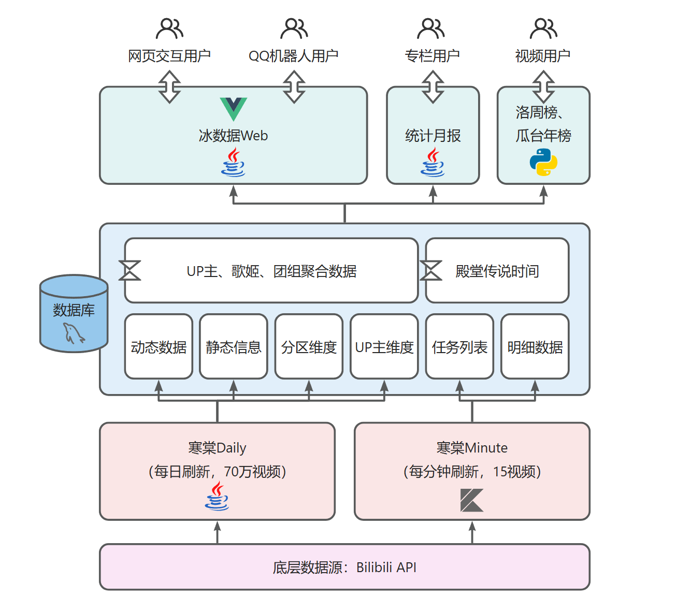

## Intro

据说 icedata 的历史可以追溯到 2013 年成立的 iceorange。

但是一般地，认为 icedata 成立于 2019 年 2 月 22 日。因为那个时候冰数据从简单的几个个人，成为了一个组织。现在的冰数据，致力于建设一个 Bilibili 虚拟歌手社群的非官方数据中台，获取、存储、统计有关虚拟歌手投稿的各项数据，以 Web、可视化视频、专栏甚至 QQ 聊天机器人等多种方式呈现。

## Apps

### Hantang Daily

以日为时间粒度，每日获取B站数据，包括视频动态数据和静态数据，以及对数据进行OLAP聚合。视频条数数量级在70万。目前在灰度运行。主要作用是给下游周刊、月刊、年刊提供数据支持。

是作为数据源的纯后台应用，不和用户交互。主要技术栈为 `Java` `MySQL`。

[GitHub仓库](https://github.com/icedata-top/hantang-daily)

[GitEE仓库](https://gitee.com/icedata-foundation-frame/hantang-daily)

### Hantang Minute

以分钟为时间粒度，每分钟获取B站数据。目前已经写好了。主要作用是记录视频殿堂、传说时刻（精确到分钟）。

是作为数据源的纯后台应用，不和用户交互。主要技术栈为 `Kotlin` `MySQL`。

暂未开源，适当重构后开源。

### icedata Web

用于用户查询数据，例如某首歌何时殿堂、传说，某首歌最近的流量情况，以及全VU区的情况、某个歌姬的情况、某个UP主的情况，适当做数据可视化。前后端分离，后端不能主要技术栈为 `Java` `Javalin` `MySQL`，前端主要技术栈为`TypeScript` `Vue3`。

需求调研阶段

### 统计月报

主要技术栈为 `Java` `MySQL`。

[Bilibili专栏文集](https://www.bilibili.com/read/readlist/rl68394?spm_id_from=333.999.0.0)
&nbsp;&nbsp;&nbsp;&nbsp;
[GitHub仓库](https://github.com/JingyuNankin/Icedata_Monthly_Statistical_Report) （未来会迁移至本组织）

### 洛天依新曲排行榜

主要技术栈为 `Python` `MySQL`。

[Bilibili视频合集](https://space.bilibili.com/67946083/channel/collectiondetail?sid=1364628)
&nbsp;&nbsp;&nbsp;&nbsp;
[GitEE仓库](https://gitee.com/icedata-foundation-frame/luotianyi-weekly-ranking) （未来会迁移至GitHub）
